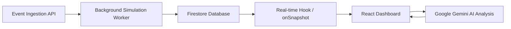

# 🚀 NexusStream.ai | AI-Autonomous Operations Intelligence


NexusStream.ai is a **Real-Time Operations Intelligence Engine** designed for high-scale enterprise environments. It transforms raw ingestion streams into actionable business intelligence using autonomous neural guardians.


## 📸 Product Preview

### 📊  Dashboard


### 🚨 Anomaly Detection


---

## 💎 Elite Features (TOP 1% Showcase)

### 🧠 Neural Command Center (Interactive GenAI)
A real-time "Ask your data" interface powered by **Google Gemini-3 Flash**. Query your live transaction streams using natural language to extract deep hidden patterns without writing SQL or code.

### 🧬 Predictive Scenario Simulation
The "What-if" engine. Project the business impact of price changes, traffic surges, or marketing campaigns using neural probability matrices. Move from *what happened* to *what will happen*.

### 🚩 Anomaly Shield & Toast HUD
Real-time statistical anomaly detection highlighted through an interactive Toast HUD. Instantly identify "Whale" transactions or suspicious volume spikes.

### 📈 Business-First Intelligence
Beyond technical metrics, NexusStream tracks **LTV (Lifetime Value)**, **Conversion Rates**, and **Retention** in real-time, providing a 360° view of business health.

---

## 🛠️ Performance Architecture

- **Sub-20ms Ingestion**: Powered by an async Node.js/Express pipeline.
- **Neural Sync**: Firestore onSnapshot listeners for zero-latency UI updates.
- **Vector-Ready Scaling**: Designed for multi-tenant SaaS environments.

---

### 🛡️ Intelligent Observability & Incident Center
- **Proactive Toast HUD**: Auto-dismissing alerts with severity levels (Critical, Warning, Info).
- **Incidents Inbox**: A dedicated notification center to track, read, and manage historical anomalies.
- **Logic Filters**: Use `docChanges` to optimize real-time event processing and minimize re-renders.

---

## 🎥 Recording your Demo (Portfolio Pro-tip)
To showcase the full power of NexusStream in your GitHub portfolio:
1. **Simulate an Event**: Click "Ingest Event" to trigger a transaction.
2. **Watch the HUD**: See the toast appear and auto-dismiss.
3. **Check the Inbox**: Open the bell icon (🔔) to see the historical log.
4. **Neural Analysis**: Use the Neural Command Center to ask "Explain why this was flagged as a risk."

---

## 🏗️ Architecture



---

## 🚀 Getting Started

### 1. Prerequisites
- Node.js v18+
- Firebase Project setup

### 2. Installation
```bash
git clone https://github.com/yourusername/nexusstream-ai.git
cd nexusstream-ai
npm install
```

### 3. Environment Variables
Create a `.env` file in the root using the template from `.env.example`:
```env
# AI Intelligence
GEMINI_API_KEY=your_gemini_api_key

# Firebase Core (Client-side exposed keys must be prefixed with VITE_)
VITE_FIREBASE_API_KEY=your_api_key
VITE_FIREBASE_AUTH_DOMAIN=your_auth_domain
VITE_FIREBASE_PROJECT_ID=your_project_id
VITE_FIREBASE_STORAGE_BUCKET=your_storage_bucket
VITE_FIREBASE_MESSAGING_SENDER_ID=your_sender_id
VITE_FIREBASE_APP_ID=your_app_id
VITE_FIREBASE_DATABASE_ID=your_database_id (default is (default))
```

### 4. Run the engine
```bash
npm run dev
```

---

## 📈 Roadmap

- [x] **Phase 1: Ingestion & Real-time Sync** (MVP)
- [x] **Phase 2: AI-Powered Insights & Anomaly HUD** (Pro)
- [ ] **Phase 3: Deep Predictive Analytics** (Train custom models on historical streams)
- [ ] **Phase 4: Multi-region Cluster Monitoring** (Support for globally distributed data sources)

---

## 👤 Author

*Brayan Rodriguez* 

- GitHub: https://github.com/AnkShoji
- LinkedIn: www.linkedin.com/in/brayan-rodriguez-dev

---

> This project was developed as a case study for advanced full-stack real-time architectures and AI integration.
